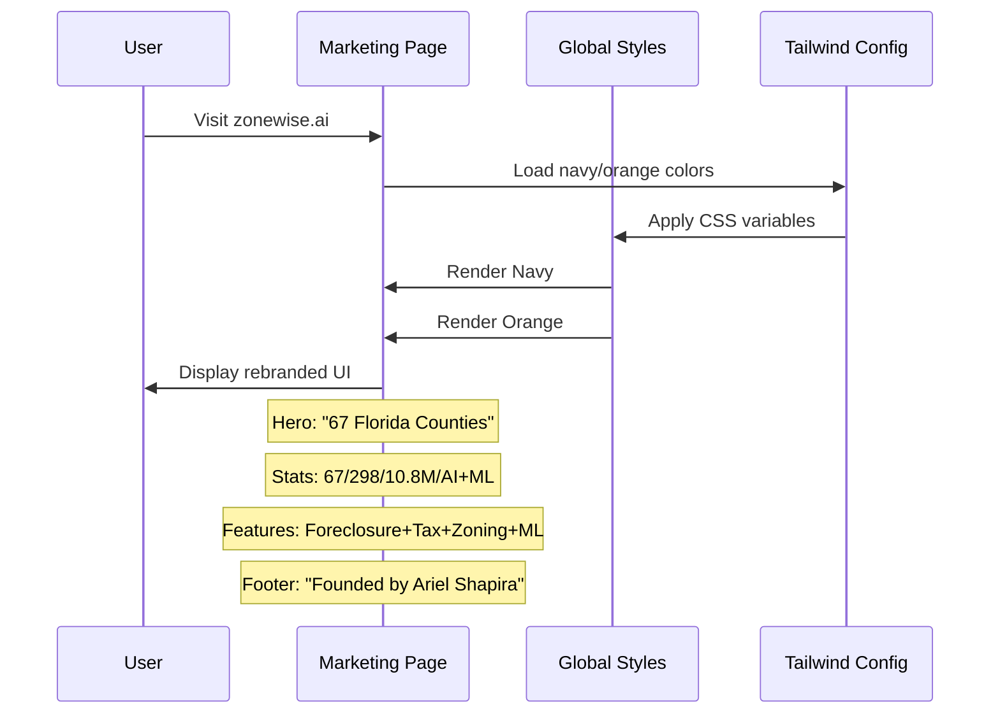

<!-- traycer_root_comment_start -->
<!-- traycer_plan_start -->
<!-- This is an auto-generated comment: by traycer.ai -->

# Plan

## Observations

The current ZoneWise.AI marketing site uses a **teal-based color scheme** (`#0D9488`) with Brevard County-focused messaging. The codebase is a Next.js 14 application with inline styling in `file:app/(marketing)/page.tsx`, global CSS variables in `file:app/globals.css`, and Tailwind configuration in `file:tailwind.config.ts`. The brand documentation (`file:docs/BRAND_COLORS.md`) already specifies the correct Navy + Orange palette, but the implementation hasn't been updated. The site currently emphasizes zoning intelligence for 17 jurisdictions, while the target rebrand positions it as a statewide AI-powered real estate intelligence platform covering 67 counties with foreclosure, tax deed, and ML capabilities.

## Approach

The rebrand will be executed through a **systematic color migration** and **content transformation** across four core files. First, establish the Navy + Orange color system in `file:tailwind.config.ts` and `file:app/globals.css` by replacing all teal CSS variables with navy equivalents and adding orange accent colors. Second, update `file:app/layout.tsx` metadata to reflect statewide positioning and change the theme color from teal to navy. Third, comprehensively rewrite `file:app/(marketing)/page.tsx` to replace all teal Tailwind classes with navy/orange, update copy from Brevard County to 67 Florida Counties, add new sections for foreclosure/tax deed/ML features, include founder credit with Everest Capital link, and add a split-screen UI preview section. The Inter font will replace DM Sans via Google Fonts import update.

## Implementation Steps

### Phase 1: Foundation — Color System & Global Styles

#### 1.1 Update Tailwind Configuration (`file:tailwind.config.ts`)

Extend the theme colors to include the complete navy palette and orange accent colors:

```typescript
colors: {
  navy: {
    50: '#E8F4FD',
    100: '#C5DEF0',
    200: '#8FBDDE',
    300: '#5A9CC9',
    400: '#2D6FA0',
    500: '#1E3A5F',
    600: '#1E3A5F',  // PRIMARY
    700: '#152A45',
    800: '#0E1D30',
    900: '#07111C',
  },
  brand: {
    orange: '#F59E0B',
    'orange-dark': '#D97706',
    'orange-light': '#FBBF24',
  }
}
```

Remove or deprecate the existing `zw-teal` color reference.

#### 1.2 Replace CSS Variables (`file:app/globals.css`)

**Lines 7-42**: Replace the entire `:root` block with navy-based variables:

- Remove all `--teal-*` variables (lines 8-18)
- Add `--navy-*` variables (50 through 900)
- Add `--orange-*` variables (400, 500, 600)
- Update semantic variables:
  - `--background: #FFFFFF` (change from `var(--slate-950)`)
  - `--foreground: #1E293B` (change from `var(--slate-100)`)
  - `--primary: var(--navy-600)` (change from `var(--teal-600)`)
  - `--accent: var(--orange-500)` (new)
  - `--muted: #F1F5F9` (change from `var(--slate-800)`)
  - `--border: #E2E8F0` (change from `var(--slate-800)`)
  - `--ring: var(--navy-500)` (change from `var(--teal-500)`)

**Line 1**: Update Google Fonts import to use Inter instead of DM Sans:
```css
@import url('https://fonts.googleapis.com/css2?family=Inter:wght@400;500;600;700;800&family=JetBrains+Mono:wght@400;500;600&display=swap');
```

**Line 54**: Update font-family to Inter:
```css
font-family: 'Inter', -apple-system, BlinkMacSystemFont, 'Segoe UI', sans-serif;
```

**Lines 79-82**: Update selection color from teal to navy
**Lines 85-88**: Update focus ring from teal to navy
**Lines 66-76**: Update scrollbar colors to use navy instead of slate
**Lines 250-254**: Update gradient-text class to use navy instead of teal
**Line 270**: Update card-hover shadow to use navy/orange glow instead of teal
**Line 285**: Update status-online indicator to use navy instead of teal

#### 1.3 Update Layout Metadata (`file:app/layout.tsx`)

**Line 5**: Update title:
```typescript
title: 'ZoneWise.AI - Florida\'s AI-Powered Real Estate Intelligence'
```

**Line 6**: Update description:
```typescript
description: 'Foreclosure auctions, tax deed sales, and zoning intelligence across 67 Florida counties. 298 KPIs, 10.8M parcels, powered by AI and machine learning.'
```

**Line 16**: Update theme color:
```typescript
themeColor: '#1E3A5F'
```

---

### Phase 2: Marketing Page Transformation

#### 2.1 Header Section (`file:app/(marketing)/page.tsx`, Lines 7-23)

**Line 10**: Update logo background from `bg-teal-600` to `bg-[#1E3A5F]`

**Line 18**: Update CTA button from `bg-teal-600 hover:bg-teal-700` to `bg-[#1E3A5F] hover:bg-[#152A45]`

**Line 16**: Add "Features" link before "Pricing":
```tsx
<a href="#features" className="text-gray-600 hover:text-slate-800 hidden sm:block">Features</a>
```

#### 2.2 Hero Section (Lines 25-39)

**Lines 28-31**: Replace headline:
```tsx
<h1 className="text-4xl sm:text-5xl font-bold text-slate-800 mb-6">
  Florida's AI-Powered
  <span className="text-[#1E3A5F] block mt-2">Real Estate Intelligence</span>
</h1>
```

**Lines 32-34**: Replace subtitle:
```tsx
<p className="text-xl text-gray-600 mb-8">
  Foreclosure auctions. Tax deed sales. Zoning intelligence. 298 KPIs across 67 Florida counties — powered by machine learning.
</p>
```

**Line 35**: Update CTA button styling and text:
```tsx
<Link href="/signup" className="inline-block bg-[#1E3A5F] text-white px-8 py-4 rounded-lg text-lg font-semibold hover:bg-[#152A45] transition-all hover:shadow-lg hover:shadow-[#F59E0B]/20">
  Request Early Access
</Link>
```

**After line 37**: Add founder credit section:
```tsx
<p className="text-sm text-gray-500 mt-6">
  Founded by <a href="https://everestcapitalusa.com" target="_blank" rel="noopener noreferrer" className="text-[#1E3A5F] hover:text-[#F59E0B] font-medium">Ariel Shapira</a> · Powering <a href="https://everestcapitalusa.com" target="_blank" rel="noopener noreferrer" className="text-[#1E3A5F] hover:text-[#F59E0B] font-medium">Everest Capital USA</a>
</p>
```

#### 2.3 Stats Bar (Lines 41-49)

**Line 42**: Update background from `bg-slate-800` to `bg-[#1E3A5F]`

**Lines 44-47**: Replace all stats with new data and update number color from `text-teal-400` to `text-[#F59E0B]`:
```tsx
<div><p className="text-3xl font-bold text-[#F59E0B]">67</p><p className="text-slate-300">Counties</p></div>
<div><p className="text-3xl font-bold text-[#F59E0B]">298</p><p className="text-slate-300">KPIs</p></div>
<div><p className="text-3xl font-bold text-[#F59E0B]">10.8M</p><p className="text-slate-300">Parcels</p></div>
<div><p className="text-3xl font-bold text-[#F59E0B]">AI + ML</p><p className="text-slate-300">Predictions</p></div>
```

#### 2.4 New "Our Edge" Section (Insert after Stats, before Features)

Add a new section highlighting the 20-year distressed asset experience:

```tsx
{/* Our Edge */}
<section className="py-20 bg-white">
  <div className="max-w-5xl mx-auto px-4">
    <div className="text-center mb-12">
      <h2 className="text-3xl font-bold text-slate-800 mb-4">The Engine Behind 20 Years of Distressed Asset Success</h2>
      <p className="text-lg text-gray-600 max-w-3xl mx-auto">
        Born from two decades of buying at Florida foreclosure sales and tax deed auctions — both at the courthouse and online — ZoneWise.AI turns hard-won experience into an AI and machine learning engine that delivers an unfair advantage.
      </p>
    </div>
    <div className="grid md:grid-cols-2 gap-8">
      <div className="p-6 border border-gray-200 rounded-xl hover:border-[#F59E0B] transition-colors">
        <div className="w-12 h-12 bg-[#E8F4FD] rounded-lg flex items-center justify-center mb-4">
          <span className="text-2xl">⚖️</span>
        </div>
        <h3 className="font-semibold text-lg mb-2 text-[#1E3A5F]">Foreclosure Intelligence</h3>
        <p className="text-gray-600">AI-powered lien priority analysis, title search automation, bid calculation, and auction outcome predictions.</p>
      </div>
      <div className="p-6 border border-gray-200 rounded-xl hover:border-[#F59E0B] transition-colors">
        <div className="w-12 h-12 bg-[#E8F4FD] rounded-lg flex items-center justify-center mb-4">
          <span className="text-2xl">📜</span>
        </div>
        <h3 className="font-semibold text-lg mb-2 text-[#1E3A5F]">Tax Deed Analysis</h3>
        <p className="text-gray-600">Delinquent certificate detection, surplus identification, cost modeling, and redemption probability scoring.</p>
      </div>
      <div className="p-6 border border-gray-200 rounded-xl hover:border-[#F59E0B] transition-colors">
        <div className="w-12 h-12 bg-[#E8F4FD] rounded-lg flex items-center justify-center mb-4">
          <span className="text-2xl">🗺️</span>
        </div>
        <h3 className="font-semibold text-lg mb-2 text-[#1E3A5F]">Zoning & Land Use</h3>
        <p className="text-gray-600">67-county coverage, setback calculations, permitted use verification, and highest-and-best-use analysis.</p>
      </div>
      <div className="p-6 border border-gray-200 rounded-xl hover:border-[#F59E0B] transition-colors">
        <div className="w-12 h-12 bg-[#E8F4FD] rounded-lg flex items-center justify-center mb-4">
          <span className="text-2xl">🤖</span>
        </div>
        <h3 className="font-semibold text-lg mb-2 text-[#1E3A5F]">ML Predictions</h3>
        <p className="text-gray-600">XGBoost auction outcome probability, price predictions, risk scoring, and portfolio optimization.</p>
      </div>
    </div>
  </div>
</section>
```

#### 2.5 Features Section Update (Lines 51-79)

**Line 54**: Update heading to "How It Works"

**Lines 57-59**: Update icon background from `bg-teal-100` to `bg-[#E8F4FD]`

**Lines 64-66**: Update icon background (same as above)

**Lines 71-73**: Update icon background (same as above)

**Lines 60-61, 67-68, 74-75**: Update feature descriptions to reflect statewide scope:
- "What are the setbacks for R-1 in Satellite Beach?" → "What can I build at 123 Main St, Melbourne?"
- "Searches 301 districts across 17 jurisdictions instantly." → "AI analyzes 298 KPIs across 67 counties instantly."
- Keep the third feature as-is or update to show example output

#### 2.6 New Split-Screen Preview Section (Insert after Features)

Add a visual mockup section:

```tsx
{/* Split-Screen Preview */}
<section id="features" className="py-20 bg-gradient-to-b from-slate-50 to-white">
  <div className="max-w-6xl mx-auto px-4">
    <div className="text-center mb-12">
      <h2 className="text-3xl font-bold text-slate-800 mb-4">Ask. Analyze. Act.</h2>
      <p className="text-lg text-gray-600">Natural language queries meet real-time intelligence</p>
    </div>
    <div className="bg-white rounded-2xl shadow-2xl overflow-hidden border border-gray-200">
      <div className="grid md:grid-cols-2 divide-x divide-gray-200">
        <div className="p-8">
          <div className="flex items-center gap-2 mb-6">
            <div className="w-3 h-3 rounded-full bg-red-500"></div>
            <div className="w-3 h-3 rounded-full bg-yellow-500"></div>
            <div className="w-3 h-3 rounded-full bg-green-500"></div>
            <span className="ml-2 text-sm text-gray-500 font-mono">Chat Interface</span>
          </div>
          <div className="space-y-4">
            <div className="bg-[#E8F4FD] p-4 rounded-lg">
              <p className="text-sm text-slate-700">"What can I build at 123 Main St, Melbourne, FL?"</p>
            </div>
            <div className="bg-slate-100 p-4 rounded-lg">
              <p className="text-sm text-slate-700 font-semibold mb-2">✅ Analysis Complete</p>
              <p className="text-xs text-gray-600">Zoning: R-1 Single Family<br/>Setbacks: F:25' S:7.5' R:20'<br/>Max Height: 35'<br/>Permitted: SFR, Accessory</p>
            </div>
          </div>
        </div>
        <div className="p-8 bg-slate-50">
          <div className="flex items-center gap-2 mb-6">
            <span className="text-sm text-gray-500 font-mono">Map + Data Panel</span>
          </div>
          <div className="bg-[#1E3A5F] rounded-lg h-64 flex items-center justify-center">
            <p className="text-white/60 text-sm">[Mapbox Choropleth Preview]</p>
          </div>
        </div>
      </div>
    </div>
  </div>
</section>
```

#### 2.7 Pricing Section (Lines 82-119)

**Line 96**: Update border from `border-2 border-teal-600` to `border-2 border-[#1E3A5F]`

**Line 97**: Update badge from `bg-teal-600` to `bg-[#1E3A5F]`

**Line 105**: Update button from `bg-teal-600 hover:bg-teal-700` to `bg-[#1E3A5F] hover:bg-[#152A45]`

Keep pricing tiers and structure unchanged (Free $0, Pro $29, Team $99).

#### 2.8 Footer Section (Lines 121-134)

**Line 125**: Fix duplicate "2026" (currently shows "© 2026 ZoneWise.AI 2026")

**After line 125**: Add Everest Capital credit:
```tsx
<p>© 2026 ZoneWise.AI · Founded by <a href="https://everestcapitalusa.com" target="_blank" rel="noopener noreferrer" className="hover:text-white">Ariel Shapira</a></p>
<p className="text-xs mt-2">Powering <a href="https://everestcapitalusa.com" target="_blank" rel="noopener noreferrer" className="hover:text-white">Everest Capital USA</a></p>
```

---

### Phase 3: Verification & Testing

#### 3.1 Build Verification

Run `npm run build` to ensure:
- No TypeScript errors
- No Tailwind class conflicts
- All color references resolve correctly
- Build completes successfully

#### 3.2 Visual Regression Checklist

Test the following on localhost:3000:
- Header logo displays navy background with white "Z"
- Hero section shows navy accent color (not teal)
- Stats bar has navy background with orange numbers
- All CTA buttons are navy with orange hover glow
- "Our Edge" section cards have orange border on hover
- Pricing "Popular" badge is navy
- Footer links to everestcapitalusa.com work
- Responsive layout works on mobile (375px), tablet (768px), desktop (1440px)

#### 3.3 Content Accuracy Verification

Confirm all copy changes:
- ✅ "67 Counties" appears (not "Brevard County")
- ✅ "298 KPIs" stat is visible
- ✅ "10.8M Parcels" stat is visible
- ✅ "AI + ML Predictions" stat is visible
- ✅ "Founded by Ariel Shapira" appears in hero and footer
- ✅ Links to everestcapitalusa.com are present and functional
- ✅ Features mention foreclosure, tax deed, zoning, and ML

#### 3.4 Cross-Browser Testing

Test on:
- Chrome/Edge (Chromium)
- Firefox
- Safari (macOS/iOS)

Verify:
- Navy colors render consistently
- Orange accent colors are vibrant
- Inter font loads correctly
- No layout shifts

---

### Phase 4: Deployment

#### 4.1 Branch Strategy

Create feature branch:
```bash
git checkout -b rebrand/navy-orange-statewide
```

Commit changes with descriptive messages:
```bash
git add tailwind.config.ts app/globals.css app/layout.tsx
git commit -m "feat: update color system to Navy + Orange brand"

git add app/(marketing)/page.tsx
git commit -m "feat: rebrand marketing page - 67 counties, founder credit, new features"
```

#### 4.2 Pull Request

Create PR with:
- **Title**: "🎨 Rebrand: Navy + Orange, 67 Counties, Founder Credit"
- **Description**: Reference GitHub issue #1, include before/after screenshots
- **Checklist**: All acceptance criteria from ticket
- **Reviewers**: Assign PM (Ariel) for approval

#### 4.3 Deployment to Production

After PR merge:
- Verify auto-deploy to Render triggers (or manual deploy if needed)
- Monitor build logs for errors
- Verify zonewise.ai loads with new branding
- Test all 10 inbound links from everestcapitalusa.com

#### 4.4 Post-Deployment Validation

- [ ] Run Lighthouse audit (target: 90+ performance, 100 accessibility)
- [ ] Verify meta tags show navy theme color in browser chrome
- [ ] Test PWA install on mobile (icon should reflect new brand)
- [ ] Confirm Google Fonts Inter loads (check Network tab)
- [ ] Verify no console errors or warnings

---

## Visual Reference



---

## Out of Scope

The following are **NOT** included in this rebrand sprint:
- Dashboard/app UI rebrand (only marketing page)
- Stripe pricing tier changes
- Authentication flow updates
- Actual data pipeline for 67 counties
- Functional split-screen app (only mockup/preview)
- Logo design finalization (using text-based mark)
- README.md updates (keep as-is)

---

## Acceptance Criteria Summary

- ✅ Zero teal/cyan visible on marketing page
- ✅ Navy `#1E3A5F` is primary brand color
- ✅ Orange `#F59E0B` is accent color
- ✅ "67 Florida Counties" replaces "Brevard County"
- ✅ "Founded by Ariel Shapira" visible
- ✅ Link to everestcapitalusa.com present
- ✅ Stats: 67 Counties / 298 KPIs / 10.8M Parcels / AI + ML
- ✅ Features: Foreclosure + Tax Deed + Zoning + ML
- ✅ Inter font loaded
- ✅ Responsive on mobile (375px+)
- ✅ Build passes with zero errors
- ✅ All routes functional (/login, /signup, /terms, /privacy, /disclaimer)
## Import In IDE
<p><!-- VSCode Link -->
    <a href="https://import-ticket.traycer.ai/import-ticket/vscode?userId=245927826&repoId=1143596497&ticketId=fb2571a4-34d3-40cd-9a88-dec2d14875bb&ticketSource=0" target="_blank" rel="noopener noreferrer" title="Open in VSCode">
      <picture>
        <source media="(prefers-color-scheme: dark)" srcset="https://assets.traycer.ai/vscode-dark.svg">
        <source media="(prefers-color-scheme: light)" srcset="https://assets.traycer.ai/vscode-light.svg">
        
      </picture>
    </a>
<!-- Cursor Link -->
    <a href="https://import-ticket.traycer.ai/import-ticket/cursor?userId=245927826&repoId=1143596497&ticketId=fb2571a4-34d3-40cd-9a88-dec2d14875bb&ticketSource=0" target="_blank" rel="noopener noreferrer" title="Open in Cursor">
      <picture>
        <source media="(prefers-color-scheme: dark)" srcset="https://assets.traycer.ai/cursor-dark.svg">
        <source media="(prefers-color-scheme: light)" srcset="https://assets.traycer.ai/cursor-light.svg">
        
      </picture>
    </a>
<!-- Windsurf Link -->
    <a href="https://import-ticket.traycer.ai/import-ticket/windsurf?userId=245927826&repoId=1143596497&ticketId=fb2571a4-34d3-40cd-9a88-dec2d14875bb&ticketSource=0" target="_blank" rel="noopener noreferrer" title="Open in Windsurf">
      <picture>
        <source media="(prefers-color-scheme: dark)" srcset="https://assets.traycer.ai/windsurf-dark.svg">
        <source media="(prefers-color-scheme: light)" srcset="https://assets.traycer.ai/windsurf-light.svg">
        
      </picture>
    </a></p>


<details>
<summary>🤖 Prompt for AI Agents</summary>

~~~markdown
## Observations

The current ZoneWise.AI marketing site uses a **teal-based color scheme** (`#0D9488`) with Brevard County-focused messaging. The codebase is a Next.js 14 application with inline styling in `file:app/(marketing)/page.tsx`, global CSS variables in `file:app/globals.css`, and Tailwind configuration in `file:tailwind.config.ts`. The brand documentation (`file:docs/BRAND_COLORS.md`) already specifies the correct Navy + Orange palette, but the implementation hasn't been updated. The site currently emphasizes zoning intelligence for 17 jurisdictions, while the target rebrand positions it as a statewide AI-powered real estate intelligence platform covering 67 counties with foreclosure, tax deed, and ML capabilities.

## Approach

The rebrand will be executed through a **systematic color migration** and **content transformation** across four core files. First, establish the Navy + Orange color system in `file:tailwind.config.ts` and `file:app/globals.css` by replacing all teal CSS variables with navy equivalents and adding orange accent colors. Second, update `file:app/layout.tsx` metadata to reflect statewide positioning and change the theme color from teal to navy. Third, comprehensively rewrite `file:app/(marketing)/page.tsx` to replace all teal Tailwind classes with navy/orange, update copy from Brevard County to 67 Florida Counties, add new sections for foreclosure/tax deed/ML features, include founder credit with Everest Capital link, and add a split-screen UI preview section. The Inter font will replace DM Sans via Google Fonts import update.

## Implementation Steps

### Phase 1: Foundation — Color System & Global Styles

#### 1.1 Update Tailwind Configuration (`file:tailwind.config.ts`)

Extend the theme colors to include the complete navy palette and orange accent colors:

```typescript
colors: {
  navy: {
    50: '#E8F4FD',
    100: '#C5DEF0',
    200: '#8FBDDE',
    300: '#5A9CC9',
    400: '#2D6FA0',
    500: '#1E3A5F',
    600: '#1E3A5F',  // PRIMARY
    700: '#152A45',
    800: '#0E1D30',
    900: '#07111C',
  },
  brand: {
    orange: '#F59E0B',
    'orange-dark': '#D97706',
    'orange-light': '#FBBF24',
  }
}
```

Remove or deprecate the existing `zw-teal` color reference.

#### 1.2 Replace CSS Variables (`file:app/globals.css`)

**Lines 7-42**: Replace the entire `:root` block with navy-based variables:

- Remove all `--teal-*` variables (lines 8-18)
- Add `--navy-*` variables (50 through 900)
- Add `--orange-*` variables (400, 500, 600)
- Update semantic variables:
  - `--background: #FFFFFF` (change from `var(--slate-950)`)
  - `--foreground: #1E293B` (change from `var(--slate-100)`)
  - `--primary: var(--navy-600)` (change from `var(--teal-600)`)
  - `--accent: var(--orange-500)` (new)
  - `--muted: #F1F5F9` (change from `var(--slate-800)`)
  - `--border: #E2E8F0` (change from `var(--slate-800)`)
  - `--ring: var(--navy-500)` (change from `var(--teal-500)`)

**Line 1**: Update Google Fonts import to use Inter instead of DM Sans:
```css
@import url('https://fonts.googleapis.com/css2?family=Inter:wght@400;500;600;700;800&family=JetBrains+Mono:wght@400;500;600&display=swap');
```

**Line 54**: Update font-family to Inter:
```css
font-family: 'Inter', -apple-system, BlinkMacSystemFont, 'Segoe UI', sans-serif;
```

**Lines 79-82**: Update selection color from teal to navy
**Lines 85-88**: Update focus ring from teal to navy
**Lines 66-76**: Update scrollbar colors to use navy instead of slate
**Lines 250-254**: Update gradient-text class to use navy instead of teal
**Line 270**: Update card-hover shadow to use navy/orange glow instead of teal
**Line 285**: Update status-online indicator to use navy instead of teal

#### 1.3 Update Layout Metadata (`file:app/layout.tsx`)

**Line 5**: Update title:
```typescript
title: 'ZoneWise.AI - Florida\'s AI-Powered Real Estate Intelligence'
```

**Line 6**: Update description:
```typescript
description: 'Foreclosure auctions, tax deed sales, and zoning intelligence across 67 Florida counties. 298 KPIs, 10.8M parcels, powered by AI and machine learning.'
```

**Line 16**: Update theme color:
```typescript
themeColor: '#1E3A5F'
```

---

### Phase 2: Marketing Page Transformation

#### 2.1 Header Section (`file:app/(marketing)/page.tsx`, Lines 7-23)

**Line 10**: Update logo background from `bg-teal-600` to `bg-[#1E3A5F]`

**Line 18**: Update CTA button from `bg-teal-600 hover:bg-teal-700` to `bg-[#1E3A5F] hover:bg-[#152A45]`

**Line 16**: Add "Features" link before "Pricing":
```tsx
<a href="#features" className="text-gray-600 hover:text-slate-800 hidden sm:block">Features</a>
```

#### 2.2 Hero Section (Lines 25-39)

**Lines 28-31**: Replace headline:
```tsx
<h1 className="text-4xl sm:text-5xl font-bold text-slate-800 mb-6">
  Florida's AI-Powered
  <span className="text-[#1E3A5F] block mt-2">Real Estate Intelligence</span>
</h1>
```

**Lines 32-34**: Replace subtitle:
```tsx
<p className="text-xl text-gray-600 mb-8">
  Foreclosure auctions. Tax deed sales. Zoning intelligence. 298 KPIs across 67 Florida counties — powered by machine learning.
</p>
```

**Line 35**: Update CTA button styling and text:
```tsx
<Link href="/signup" className="inline-block bg-[#1E3A5F] text-white px-8 py-4 rounded-lg text-lg font-semibold hover:bg-[#152A45] transition-all hover:shadow-lg hover:shadow-[#F59E0B]/20">
  Request Early Access
</Link>
```

**After line 37**: Add founder credit section:
```tsx
<p className="text-sm text-gray-500 mt-6">
  Founded by <a href="https://everestcapitalusa.com" target="_blank" rel="noopener noreferrer" className="text-[#1E3A5F] hover:text-[#F59E0B] font-medium">Ariel Shapira</a> · Powering <a href="https://everestcapitalusa.com" target="_blank" rel="noopener noreferrer" className="text-[#1E3A5F] hover:text-[#F59E0B] font-medium">Everest Capital USA</a>
</p>
```

#### 2.3 Stats Bar (Lines 41-49)

**Line 42**: Update background from `bg-slate-800` to `bg-[#1E3A5F]`

**Lines 44-47**: Replace all stats with new data and update number color from `text-teal-400` to `text-[#F59E0B]`:
```tsx
<div><p className="text-3xl font-bold text-[#F59E0B]">67</p><p className="text-slate-300">Counties</p></div>
<div><p className="text-3xl font-bold text-[#F59E0B]">298</p><p className="text-slate-300">KPIs</p></div>
<div><p className="text-3xl font-bold text-[#F59E0B]">10.8M</p><p className="text-slate-300">Parcels</p></div>
<div><p className="text-3xl font-bold text-[#F59E0B]">AI + ML</p><p className="text-slate-300">Predictions</p></div>
```

#### 2.4 New "Our Edge" Section (Insert after Stats, before Features)

Add a new section highlighting the 20-year distressed asset experience:

```tsx
{/* Our Edge */}
<section className="py-20 bg-white">
  <div className="max-w-5xl mx-auto px-4">
    <div className="text-center mb-12">
      <h2 className="text-3xl font-bold text-slate-800 mb-4">The Engine Behind 20 Years of Distressed Asset Success</h2>
      <p className="text-lg text-gray-600 max-w-3xl mx-auto">
        Born from two decades of buying at Florida foreclosure sales and tax deed auctions — both at the courthouse and online — ZoneWise.AI turns hard-won experience into an AI and machine learning engine that delivers an unfair advantage.
      </p>
    </div>
    <div className="grid md:grid-cols-2 gap-8">
      <div className="p-6 border border-gray-200 rounded-xl hover:border-[#F59E0B] transition-colors">
        <div className="w-12 h-12 bg-[#E8F4FD] rounded-lg flex items-center justify-center mb-4">
          <span className="text-2xl">⚖️</span>
        </div>
        <h3 className="font-semibold text-lg mb-2 text-[#1E3A5F]">Foreclosure Intelligence</h3>
        <p className="text-gray-600">AI-powered lien priority analysis, title search automation, bid calculation, and auction outcome predictions.</p>
      </div>
      <div className="p-6 border border-gray-200 rounded-xl hover:border-[#F59E0B] transition-colors">
        <div className="w-12 h-12 bg-[#E8F4FD] rounded-lg flex items-center justify-center mb-4">
          <span className="text-2xl">📜</span>
        </div>
        <h3 className="font-semibold text-lg mb-2 text-[#1E3A5F]">Tax Deed Analysis</h3>
        <p className="text-gray-600">Delinquent certificate detection, surplus identification, cost modeling, and redemption probability scoring.</p>
      </div>
      <div className="p-6 border border-gray-200 rounded-xl hover:border-[#F59E0B] transition-colors">
        <div className="w-12 h-12 bg-[#E8F4FD] rounded-lg flex items-center justify-center mb-4">
          <span className="text-2xl">🗺️</span>
        </div>
        <h3 className="font-semibold text-lg mb-2 text-[#1E3A5F]">Zoning & Land Use</h3>
        <p className="text-gray-600">67-county coverage, setback calculations, permitted use verification, and highest-and-best-use analysis.</p>
      </div>
      <div className="p-6 border border-gray-200 rounded-xl hover:border-[#F59E0B] transition-colors">
        <div className="w-12 h-12 bg-[#E8F4FD] rounded-lg flex items-center justify-center mb-4">
          <span className="text-2xl">🤖</span>
        </div>
        <h3 className="font-semibold text-lg mb-2 text-[#1E3A5F]">ML Predictions</h3>
        <p className="text-gray-600">XGBoost auction outcome probability, price predictions, risk scoring, and portfolio optimization.</p>
      </div>
    </div>
  </div>
</section>
```

#### 2.5 Features Section Update (Lines 51-79)

**Line 54**: Update heading to "How It Works"

**Lines 57-59**: Update icon background from `bg-teal-100` to `bg-[#E8F4FD]`

**Lines 64-66**: Update icon background (same as above)

**Lines 71-73**: Update icon background (same as above)

**Lines 60-61, 67-68, 74-75**: Update feature descriptions to reflect statewide scope:
- "What are the setbacks for R-1 in Satellite Beach?" → "What can I build at 123 Main St, Melbourne?"
- "Searches 301 districts across 17 jurisdictions instantly." → "AI analyzes 298 KPIs across 67 counties instantly."
- Keep the third feature as-is or update to show example output

#### 2.6 New Split-Screen Preview Section (Insert after Features)

Add a visual mockup section:

```tsx
{/* Split-Screen Preview */}
<section id="features" className="py-20 bg-gradient-to-b from-slate-50 to-white">
  <div className="max-w-6xl mx-auto px-4">
    <div className="text-center mb-12">
      <h2 className="text-3xl font-bold text-slate-800 mb-4">Ask. Analyze. Act.</h2>
      <p className="text-lg text-gray-600">Natural language queries meet real-time intelligence</p>
    </div>
    <div className="bg-white rounded-2xl shadow-2xl overflow-hidden border border-gray-200">
      <div className="grid md:grid-cols-2 divide-x divide-gray-200">
        <div className="p-8">
          <div className="flex items-center gap-2 mb-6">
            <div className="w-3 h-3 rounded-full bg-red-500"></div>
            <div className="w-3 h-3 rounded-full bg-yellow-500"></div>
            <div className="w-3 h-3 rounded-full bg-green-500"></div>
            <span className="ml-2 text-sm text-gray-500 font-mono">Chat Interface</span>
          </div>
          <div className="space-y-4">
            <div className="bg-[#E8F4FD] p-4 rounded-lg">
              <p className="text-sm text-slate-700">"What can I build at 123 Main St, Melbourne, FL?"</p>
            </div>
            <div className="bg-slate-100 p-4 rounded-lg">
              <p className="text-sm text-slate-700 font-semibold mb-2">✅ Analysis Complete</p>
              <p className="text-xs text-gray-600">Zoning: R-1 Single Family<br/>Setbacks: F:25' S:7.5' R:20'<br/>Max Height: 35'<br/>Permitted: SFR, Accessory</p>
            </div>
          </div>
        </div>
        <div className="p-8 bg-slate-50">
          <div className="flex items-center gap-2 mb-6">
            <span className="text-sm text-gray-500 font-mono">Map + Data Panel</span>
          </div>
          <div className="bg-[#1E3A5F] rounded-lg h-64 flex items-center justify-center">
            <p className="text-white/60 text-sm">[Mapbox Choropleth Preview]</p>
          </div>
        </div>
      </div>
    </div>
  </div>
</section>
```

#### 2.7 Pricing Section (Lines 82-119)

**Line 96**: Update border from `border-2 border-teal-600` to `border-2 border-[#1E3A5F]`

**Line 97**: Update badge from `bg-teal-600` to `bg-[#1E3A5F]`

**Line 105**: Update button from `bg-teal-600 hover:bg-teal-700` to `bg-[#1E3A5F] hover:bg-[#152A45]`

Keep pricing tiers and structure unchanged (Free $0, Pro $29, Team $99).

#### 2.8 Footer Section (Lines 121-134)

**Line 125**: Fix duplicate "2026" (currently shows "© 2026 ZoneWise.AI 2026")

**After line 125**: Add Everest Capital credit:
```tsx
<p>© 2026 ZoneWise.AI · Founded by <a href="https://everestcapitalusa.com" target="_blank" rel="noopener noreferrer" className="hover:text-white">Ariel Shapira</a></p>
<p className="text-xs mt-2">Powering <a href="https://everestcapitalusa.com" target="_blank" rel="noopener noreferrer" className="hover:text-white">Everest Capital USA</a></p>
```

---

### Phase 3: Verification & Testing

#### 3.1 Build Verification

Run `npm run build` to ensure:
- No TypeScript errors
- No Tailwind class conflicts
- All color references resolve correctly
- Build completes successfully

#### 3.2 Visual Regression Checklist

Test the following on localhost:3000:
- Header logo displays navy background with white "Z"
- Hero section shows navy accent color (not teal)
- Stats bar has navy background with orange numbers
- All CTA buttons are navy with orange hover glow
- "Our Edge" section cards have orange border on hover
- Pricing "Popular" badge is navy
- Footer links to everestcapitalusa.com work
- Responsive layout works on mobile (375px), tablet (768px), desktop (1440px)

#### 3.3 Content Accuracy Verification

Confirm all copy changes:
- ✅ "67 Counties" appears (not "Brevard County")
- ✅ "298 KPIs" stat is visible
- ✅ "10.8M Parcels" stat is visible
- ✅ "AI + ML Predictions" stat is visible
- ✅ "Founded by Ariel Shapira" appears in hero and footer
- ✅ Links to everestcapitalusa.com are present and functional
- ✅ Features mention foreclosure, tax deed, zoning, and ML

#### 3.4 Cross-Browser Testing

Test on:
- Chrome/Edge (Chromium)
- Firefox
- Safari (macOS/iOS)

Verify:
- Navy colors render consistently
- Orange accent colors are vibrant
- Inter font loads correctly
- No layout shifts

---

### Phase 4: Deployment

#### 4.1 Branch Strategy

Create feature branch:
```bash
git checkout -b rebrand/navy-orange-statewide
```

Commit changes with descriptive messages:
```bash
git add tailwind.config.ts app/globals.css app/layout.tsx
git commit -m "feat: update color system to Navy + Orange brand"

git add app/(marketing)/page.tsx
git commit -m "feat: rebrand marketing page - 67 counties, founder credit, new features"
```

#### 4.2 Pull Request

Create PR with:
- **Title**: "🎨 Rebrand: Navy + Orange, 67 Counties, Founder Credit"
- **Description**: Reference GitHub issue #1, include before/after screenshots
- **Checklist**: All acceptance criteria from ticket
- **Reviewers**: Assign PM (Ariel) for approval

#### 4.3 Deployment to Production

After PR merge:
- Verify auto-deploy to Render triggers (or manual deploy if needed)
- Monitor build logs for errors
- Verify zonewise.ai loads with new branding
- Test all 10 inbound links from everestcapitalusa.com

#### 4.4 Post-Deployment Validation

- [ ] Run Lighthouse audit (target: 90+ performance, 100 accessibility)
- [ ] Verify meta tags show navy theme color in browser chrome
- [ ] Test PWA install on mobile (icon should reflect new brand)
- [ ] Confirm Google Fonts Inter loads (check Network tab)
- [ ] Verify no console errors or warnings

---

## Visual Reference


---

## Out of Scope

The following are **NOT** included in this rebrand sprint:
- Dashboard/app UI rebrand (only marketing page)
- Stripe pricing tier changes
- Authentication flow updates
- Actual data pipeline for 67 counties
- Functional split-screen app (only mockup/preview)
- Logo design finalization (using text-based mark)
- README.md updates (keep as-is)

---

## Acceptance Criteria Summary

- ✅ Zero teal/cyan visible on marketing page
- ✅ Navy `#1E3A5F` is primary brand color
- ✅ Orange `#F59E0B` is accent color
- ✅ "67 Florida Counties" replaces "Brevard County"
- ✅ "Founded by Ariel Shapira" visible
- ✅ Link to everestcapitalusa.com present
- ✅ Stats: 67 Counties / 298 KPIs / 10.8M Parcels / AI + ML
- ✅ Features: Foreclosure + Tax Deed + Zoning + ML
- ✅ Inter font loaded
- ✅ Responsive on mobile (375px+)
- ✅ Build passes with zero errors
- ✅ All routes functional (/login, /signup, /terms, /privacy, /disclaimer)
~~~
</details>


---


<details>
<summary>Execution Information</summary>

**Branch**: [main](https://github.com/breverdbidder/zonewise-web/tree/main)
**Commit**: 92374874cebf7bc5336edd3c33b618d79ea298a4
</details>
<!-- traycer_tip_section_start -->

---


<details>
<summary>:bulb: Tips</summary>


### Supported Commands (Inside Comments)
- Use `@traycerai generate` to iterate on the previous version of the implementation plan.

### Supported Commands (Inside Description)
- Add `@traycerai ignore` anywhere in the ticket description to prevent this ticket from being processed.
- Add `@traycerai branch:<branch-name>` anywhere in the ticket description to specify the target branch for the implementation plan.

### Community

- Join our [Discord Community](https://traycer.ai/discord) to get help, request features, and share feedback.
- Follow us on [X/Twitter](https://twitter.com/traycerai) for updates and announcements.

</details>

<!-- traycer_tip_section_end -->
<!-- traycer_plan_end -->
<!-- traycer_root_comment_end -->
